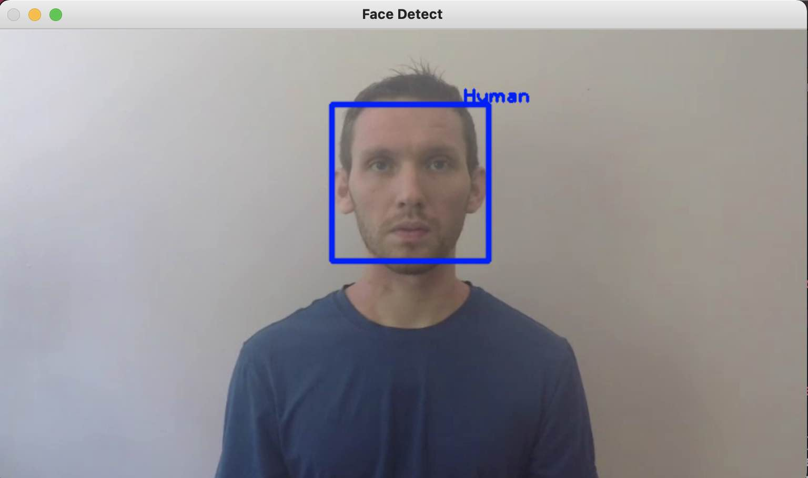
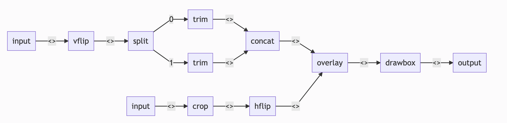

# ffmpeg-go

ffmpeg-go is golang port of https://github.com/kkroening/ffmpeg-python

check examples/example_test.go and ffmpeg_test.go for more examples.

# Examples

```go
split := Input(TestInputFile1).VFlip().Split()
	split0, split1 := split.Get("0"), split.Get("1")
	overlayFile := Input(TestOverlayFile).Crop(10, 10, 158, 112)
err := Concat([]*Stream{
    split0.Trim(KwArgs{"start_frame": 10, "end_frame": 20}),
    split1.Trim(KwArgs{"start_frame": 30, "end_frame": 40})}).
    Overlay(overlayFile.HFlip(), "").
    DrawBox(50, 50, 120, 120, "red", 5).
    Output(TestOutputFile1).
    OverWriteOutput().
    Run()
```

## Transcoding From One Codec To Another

```go
err := ffmpeg.Input("./sample_data/in1.mp4").
		Output("./sample_data/out1.mp4", ffmpeg.KwArgs{"c:v": "libx265"}).
		OverWriteOutput().ErrorToStdOut().Run()
```

## Cut Video From Timestamp

```go
err := ffmpeg.Input("./sample_data/in1.mp4", ffmpeg.KwArgs{"ss": 1}).
    Output("./sample_data/out1.mp4", ffmpeg.KwArgs{"t": 1}).OverWriteOutput().Run()
assert.Nil(t, err)
```

## Add Watermark For Video
```go
// show watermark with size 64:-1 in the top left corner after seconds 1
overlay := ffmpeg.Input("./sample_data/overlay.png").Filter("scale", ffmpeg.Args{"64:-1"})
err := ffmpeg.Filter(
    []*ffmpeg.Stream{
        ffmpeg.Input("./sample_data/in1.mp4"),
        overlay,
    }, "overlay", ffmpeg.Args{"10:10"}, ffmpeg.KwArgs{"enable": "gte(t,1)"}).
    Output("./sample_data/out1.mp4").OverWriteOutput().ErrorToStdOut().Run()
```

result:


## Cut Video For Gif 

```go
err := ffmpeg.Input("./sample_data/in1.mp4", ffmpeg.KwArgs{"ss": "1"}).
    Output("./sample_data/out1.gif", ffmpeg.KwArgs{"s": "320x240", "pix_fmt": "rgb24", "t": "3", "r": "3"}).
    OverWriteOutput().ErrorToStdOut().Run()
```

result:


## Task Frame From Video

```bash
func ExampleReadFrameAsJpeg(inFileName string, frameNum int) io.Reader {
	buf := bytes.NewBuffer(nil)
	err := ffmpeg.Input(inFileName).
		Filter("select", ffmpeg.Args{fmt.Sprintf("gte(n,%d)", frameNum)}).
		Output("pipe:", ffmpeg.KwArgs{"vframes": 1, "format": "image2", "vcodec": "mjpeg"}).
		WithOutput(buf, os.Stdout).
		Run()
	if err != nil {
		panic(err)
	}
	return buf
}

reader := ExampleReadFrameAsJpeg("./sample_data/in1.mp4", 5)
img, err := imaging.Decode(reader)
if err != nil {
    t.Fatal(err)
}
err = imaging.Save(img, "./sample_data/out1.jpeg")
if err != nil {
    t.Fatal(err)
}
```
result : 


## Get Multiple Output

```go
// get multiple output with different size/bitrate
input := ffmpeg.Input("./sample_data/in1.mp4").Split()
out1 := input.Get("0").Filter("scale", ffmpeg.Args{"1920:-1"}).
Output("./sample_data/1920.mp4", ffmpeg.KwArgs{"b:v": "5000k"})
out2 := input.Get("1").Filter("scale", ffmpeg.Args{"1280:-1"}).
Output("./sample_data/1280.mp4", ffmpeg.KwArgs{"b:v": "2800k"})

err := ffmpeg.MergeOutputs(out1, out2).OverWriteOutput().ErrorToStdOut().Run()
```

## Show FFmpeg Progress

see complete example at: [showProgress](./examples/showProgress.go)

```bash
func ExampleShowProgress(inFileName, outFileName string) {
	a, err := ffmpeg.Probe(inFileName)
	if err != nil {
		panic(err)
	}
	totalDuration := gjson.Get(a, "format.duration").Float()

	err = ffmpeg.Input(inFileName).
		Output(outFileName, ffmpeg.KwArgs{"c:v": "libx264", "preset": "veryslow"}).
		GlobalArgs("-progress", "unix://"+TempSock(totalDuration)).
		OverWriteOutput().
		Run()
	if err != nil {
		panic(err)
	}
}
ExampleShowProgress("./sample_data/in1.mp4", "./sample_data/out2.mp4")
```

result 

```bash
progress:  .0
progress:  0.72
progress:  1.00
progress:  done
```

## Integrate FFmpeg-go With Open-CV (gocv) For Face-detect

see complete example at: [opencv](./examples/opencv.go)

result: 

## Set Cpu limit/request For FFmpeg-go

```go
e := ComplexFilterExample("./sample_data/in1.mp4", "./sample_data/overlay.png", "./sample_data/out2.mp4")
err := e.RunWithResource(0.1, 0.5)
if err != nil {
    assert.Nil(t, err)
}
```

result from command top: we will see ffmpeg used 0.5 core as expected.

```bash
> top 
PID    USER       PR  NI    VIRT    RES    SHR S  %CPU   %MEM     TIME+ COMMAND
1386105 root      20   0 2114152 273780  31672 R  50.2   1.7      0:16.79 ffmpeg
```

# View Progress Graph

function view generate [mermaid](https://mermaid-js.github.io/mermaid/#/) chart, which can be use in markdown or view [online](https://mermaid-js.github.io/mermaid-live-editor/)

```go
split := Input(TestInputFile1).VFlip().Split()
	split0, split1 := split.Get("0"), split.Get("1")
	overlayFile := Input(TestOverlayFile).Crop(10, 10, 158, 112)
b, err := Concat([]*Stream{
    split0.Trim(KwArgs{"start_frame": 10, "end_frame": 20}),
    split1.Trim(KwArgs{"start_frame": 30, "end_frame": 40})}).
    Overlay(overlayFile.HFlip(), "").
    DrawBox(50, 50, 120, 120, "red", 5).
    Output(TestOutputFile1).
    OverWriteOutput().View(ViewTypeFlowChart)
fmt.Println(b)
```
